# Bit-vectors

There are times when we wish to store one bit of information about each index in a range `0, 1, ..., n-1`, for whatever reason, and for that we can use *bit vectors*.

Bit vectors are just arrays of bits, but to implement one, you often need a little bit more work than a normal array. The one exception I can think of is C++ where a `std::vector<bool>` is guaranteed by the standard to be a bit vector. Normally, though, an array of boolean values is not.

The thing is, most languages have a minimal size that an object can have, and that size is larger than a single bit. In C, for example, the smallest size an object can have is whatever the size a `char` has. The standard says `sizeof(char) == 1` and sizes can't be smaller than one. In practise, although the standard doesn't guarantee it, this is a byte, so eight bits. To store value for `n` bits, you then might try an array of `bool`

```c
#include <stdbool.h> // to get the bool type

...

bool my_array[n]; // <- an attempt at a bit vector
```

but the `my_array` is `n` bytes long, not `n` bits. If `n` is a billion, you are using a gigabyte memory where 125 megabytes would suffice for `n` boolean values.

In Python it is even worse. If you have a list of `n` `bool` values (`True` or `False`),

```python
my_list = [True] * n
```

the list really stores pointers to objects. If it only stores pointers to either the `True` or the `False` object, we can ignore the data the pointers point to, but the list will contain `n` pointers plus some overhead, and pointers on [most common architectures](https://en.wikipedia.org/wiki/X86-64) are 64 bits. So, for each bit you want to store, you are using 64 plus some change.

This doesn't matter much for small `n`; we have plenty of space to spare on modern computers, but if you are working with large data, such as full genomes, it does become noticable. Let's say we wanted to store one bit of information for each of the nucleotides in the human chromosome 1. There are about 250 billion nucleotides and we would use 250Mb (250 mega bytes) if we used a byte for each nucleotide, 16Gb (250 times 64 mega) if we used 64 bits / 8 bytes for each, and only 31Mb (250 / 8 when we pack 8 bits into each byte) if we used a bit to represent a bit.

You might have 16Gb on your computer, but programs usually need memory for more than holding a bit per nucleotide, so using 16Gb just for this bit vector might prevent you from doing whatever it is your program is supposed to do. If you only need 31Mb, however, you can usually squeeze that in. (Maybe not on the computers I grew up with, but today it shouldn't be a problem).

## What's the problem with bits?

The reason the computer doesn't readily lets you make array of bits is that the computer doesn't *work* with bits, contrary to what popular culture might suggest. A computer doesn't work with ones and zeros; it works with words and what it can address.

Let's look at what we can address first. If you have memory in RAM (and we only care about RAM right now), then you have addresses starting from zero and going up to as far as you have memory[^1]. These addresses do not point out individual bits. You can't ask the computer to give you bit 2315662 in RAM. The addresses are in some larger quantum, which on modern computers is bytes. You can address your memory in bytes, and then you get a whole byte back to work with.

It doesn't have to be bytes, you could have computers that would only give you 64-bit words, and then that would be all you can address, but bytes is what the x86_64 architectures give you, and that is the architecture you are probably using today.

Once you get data from RAM, you can work on it on the CPU, and here you also don't work on individual bits. The data you get goes into a register, and you generally work with whole registers at a time. I say generally, because it isn't always that easy for historical reasons, and you might work with sub-registers at times, but this is a mess that I don't want to get into. While it isn't entirely accurate, think of the data as going into a register, that lets you compute on the data there. The size of registers is what we sometimes call a computer word. These are typically larger than a byte, so you can have data from more than one address here, but if you want to fill a full register from RAM the CPU knows how to get the right bytes.

On the x86_64 architecture, most registers are 64 bits. (Most, because there are special registers for working with floats and vectors of floats, but the general purpose ones have 64 bits). That means that the minimal quantity of data we can work on is actually 64 bits. If we want to work on single bytes, we can still do that; we can put a single byte at the low 8 bits of a 64-bit register and put the remaining bits to zero. But we are always paying for 64-bit operations, even if we only care about eight of the bits.

This lowlevel stuff is not something we need to think about that often, and most of it we don't need to think about here either, but keep it in mind, because it affects how we can work with individual bits.

Consider the figure below, where at the top/right I have shown values we might have in RAM starting at some address `offset`. That means that the first hardware address we have at `offset` is `offset + 1`. The next is at `offset + 1` and is one byte or eight bits later. Then the next is `offset + 2` and so on. The computer doesn't let you access the individual bits, because we cannot address at fractions like `offset + 2/8`, but you can get a whole byte at a time.

The computer also works with larger word sizes than bytes. For an x86_64 architecture you can also work with 16, 32, and 64 bit words (and larger for some registers). As I mentioned above, you are actually always working with 64 bits on the CPU, it is just that you can use an eight, a quarter, half of, or a full register for your instructions. The larger word sizes span multiple bytes. A 16-bit word consists of two bytes, a 32-bit word of four bytes, and a 64-bit word of eight bytes. When you address them on the hardware, you use the byte addresses, though. So the first 16-bit word sits at `offset + 0` and the next at `offset + 2`.

You usually don't see it that way, because high-level programming languages understand that if you ask for the second value in an array, `A[1]`, you want the second value of that type. You don't, for example, want the second half of the first 16-bit word and the first half of the second 16-bit word. So programming languages work out how to map from an array address and an integral number of elements in. If we have a 16-bit word array that starts at `offset`, then the first would be at `offset + 0`, the second at `offset + 2`, the third at `offset + 4` and so on, but we would index them as `A[0]`, `A[1]`, `A[2]` and so on. The `((uint16_t*)A)[1]` bit in the figure is C syntax for saying "I want to consider `A` an array of 16-bit unsigned integers, and then I want the second element in it". It translates into finding the second 16-bit word (`offset + 2` byte) and fetching two bytes. Similar for the `((uint32_t*)A)[0]` where we want the first 32-bit integer (it sits at `offset + 0` and the next would sit at `offset + 4`) and we fetch that.

A slight aside here: in the figure, I have accessesd a 16-bit word that sits at offset 2, so a whole number of 16-bit words into the array, and I have accessed a 32-bit word at offset 0, a whole number of 32-bit words into the array (although the whole number is zero). Some architectures will only allow you to extract 16-, 32-, or 64-bit words if they sit at such offets, i.e. byte offsets that are multiples of the word sizes in bytes (2 for 16-bit words, 4 for 32-bit words, and 8 for 64-bit words). This is called [*alignment*](https://en.wikipedia.org/wiki/Data_structure_alignment). If you tried to get a word with the wrongly aligned address, the program would crash. Other architectures will freely let you access memory as multi-byte words at other offsets, x86_64 included, but there might be performance penalties to it.

Anyway, alignment is not important for the topic of bit-vectors; I just thought I would mention it. For arrays of more complex data types, it sometimes is important.

But back to bytes and words. As we see, we cannot address individual bits, but we can address words of various sizes, that are multiples of bytes.

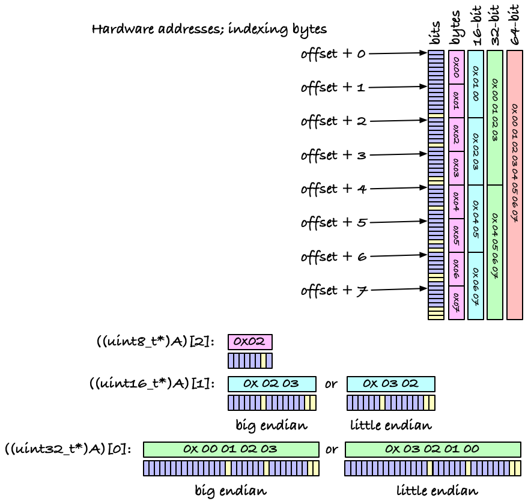

If the words are composed of multiple bytes, we run into another issue. If we interpret, say, four bytes as a single 32-bit word, which byte should then contain the most significant bits and which should contain the least significant bits? It will not surprise you to learn that hardware people have gone with both putting the first byte first in the larger word and with putting it last. This is called [endianess](https://en.wikipedia.org/wiki/Endianness) (after Jonathan Swift's Gulliver's Travels, where there is a war over which end of an egg you should put on top when eating soft-boiled eggs). One choice isn't intrinsically better than another, and you usually don't have to worry about it--the hardware will take care of managing the bits so 2-, 4-, or 8-byte integers behave the way they should. If you need to manipulate multi-byte words as their individual bytes, however, you need to consider this. It can, for example, come up when you transfer data in binary between different computers, where the computers might interpret the integers differently. For our use today, though, we won't need to consider this, but it is part of the picture.

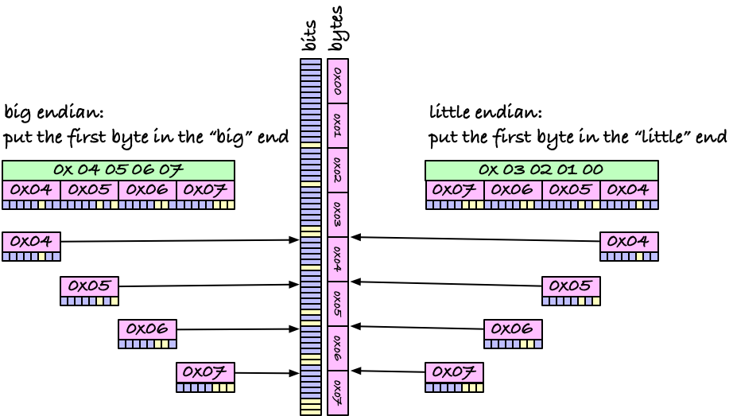

So, to boil all this down: if we want to manipulate data, we can get it in chunks of 1, 2, 4, or 8 (or maybe more) bytes, but not bits. If we use a `bool array[n]` array in C, we get one byte per value, and we thus use eight time as much memory was we need. For `[True] * n` in Python, we use 4 bytes, or 64 bits, instead of one bit, per entry. We are going to improve on that.


## Getting an array of bits

If we cannot address individual bits, but have to use multi-byte words, we have to store our bits in the larger word-size, and we must code our way out of accessing the individual bits in the larger words.

Let's first consider how we get bits in and out of individual words; getting to the words is comparatively easy and we will do that afterwards.

Let's say we have a word `w`. It doesn't matter how many bits it has, but in the figure below it is a 32-bit word. Then, let's say we want bit 17 in it. With binary numbers we write them the same as we do with decimal numbers: the most significant bit (digit) first and the least signifcant bit (digit) last. In decimal, 42 means 4 tens and two ones, and in binary, 101, means one fours, zero twos and one ones. You read the number left to right this way. When I draw a binary word, I do the same thing; the most significant bit is to the left and the least significant bit is to the right. I also number bit positions from zero, because I am a computer scientist, so the bits in a 32-bit word goes 31, 30, ..., 2, 1, 0, and bit 17 is number 18 (because we count from zero) from the right (because we write numbers in that order). Got it?

To get bit 17, we can shift all the bits in the word 17 to the right. There are 17 bits to the right of bit 17 (again because we count from zero). Shifting right by 17 throws those away (but we will be doing this in a local variable so the won't be lost in the bit vector we implement). On the left, we shift 17 bits in, and if we use unsigned integers we get zeros there. If we use signed integers, it's more complicated (and in C you don't know what you get), so use unsigned when you manipulate bits unless you are sure you know what you are doing.

Ok, so `w >> 17` moves bit 17 down to position 0, and to get the value of that bit, and only that bit, you can mask it out using a mask that has a one at bit 0 and zeros everywhere else. That is the number 1. That's all; to get bit `k` in a word, do `(w >> k) & 1`.

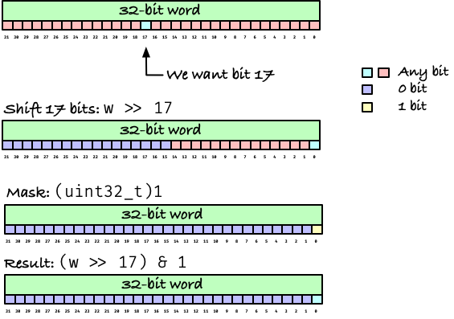


Well, that is almost all. The literal `1` might have a different type and thus a different number of bits, and things can go wrong if you just assume that `1` and `0` are, say, 32 or 64 bits. To make sure it works, you should give them the right type. It isn't necessary here, but it is a good habit to get into. So for 32-bit integers, a better solution would be `(w >> k) & (uint32_t)1`.

Another issue is the value `k`. What happens if `k` is equal to or greater than the word size, here if `k >= 32`? Well, that depends on your programming language and your computer. In C, the ever so helpful language, it is [undefined behaviour](https://en.wikipedia.org/wiki/Undefined_behavior). That typically means that whatever the hardware does is what will happen, but it could mean literally anything, so don't do it. Never shift by the wordsize or larger. If you don't, you are fine.

If you want to set a bit to 1, you do something similar. Let's say we want to set bit 17 in `w` to 1. Then we can shift a 1 17 positions to the left, `(uint32_t)1 << 17`. (Here, making sure the integer has the right word size is usually important, since shifting a smaller integer doesn't affect all the 32 bits.) Now you have a word that has zeros everywhere except for bit 17, which is a 1. If you OR this mask with your word, bit 17 is set to one because it is one in the mask, and all the other bits retain their value, as they are OR'ed with zeros.

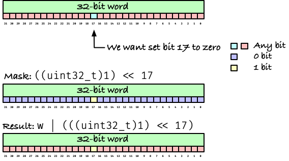

If you want to set a bit to zero, there is an additional step. You still shift a one up to the position you want to change, in the figure bit 17, but you want to flip it to zero so you cannot OR here. To flip it, you can negate the mask, i.e., flip all the bits in the mask, to get a word that has a zero at bit 17 and ones everywhere else. If you AND that with your word, all the ones will leave the word's bits as they are, but the position you want to set to zero has a zero in the mask, so the result there is also zero.

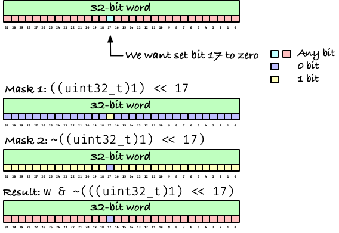

If our bit vector fits into a single computer word, 8-bit, 16-bit, 32-bit or 64-bit, then that would be all. We can access and modify individual bits with these short commands. But if the vector is longer, we need more than one word.

Of course, a sequence of multiple words is just an array of words, so we already know how to get that. If we needed a bit vector of length 150, we could use 19 bytes, 10 17-bit words, five 32-bit words or three 64-bit words.

```c
// To get the number of words, divide n by ws and round up.
size_t round_up(size_t n, size_t ws) {
    return (n + ws - 1) / ws;
}

uint8_t byte_vec[round_up(150, 8)];  // representing bits in bytes
uint16_t w16_vec[round_up(150, 16)]; // representing bits as 16-bit words
uint32_t w32_vec[round_up(150, 32)]; // representing bits as 32-bit words
uint64_t w64_vec[round_up(150, 64)]; // representing bits as 64-bit words
```

You have larger word sizes, but these will fit into registers on my machine.

If you are wondering what word size you should use, its a good question, but the answer is that it doesn't matter that much. The smaller words you use, the fewer excess bits you use if your vector doesn't span an integral number of words, but the larger the words you have, the more operations you can do in parallel when you do full-word bit operations. But it is a constant factor in any case, so it hardly matters that much. If we go from bytes to 64-bit words, it is a factor eight that's the difference. I personally prefer to use large words, to get the factor of eight in speed, at the cost of wasting up to 63 bits instead of 7, as that size difference hardly matters in any application, but it is just an arbitrary choice.

Now the only question remaining is how we will access bit `k` in such an array of words?

If we have multiple words in an array `A`, then the first word is at `A[0]`, the second at `A[1]`, the third at `A[2]` and so on, and if the word size is `ws`, then there are `ws` bits in the first word, `ws` bits in the second, and so on. To get at bit `k`, you need word `A[k/ws]` (where `k/ws` rounds down; it would be `k//ws` in Python). That's because
$$k = \mathrm{ws}\cdot\lfloor k/\mathrm{ws} \rfloor + k\mod\mathrm{ws}$$
and since we index from zero there are $\lfloor k/\mathrm{ws} \rfloor$
words before index $\lfloor k/\mathrm{ws} \rfloor$.

The same formula tells us that in word `A[k/ws]`, we want bit `k % ws`.

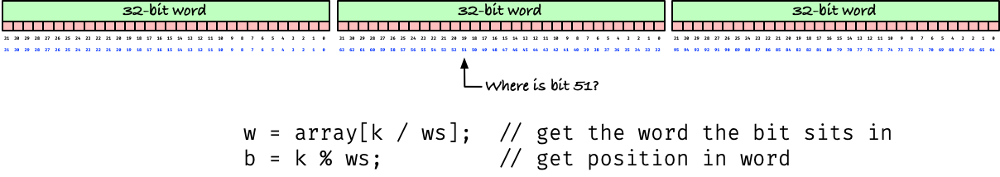

A quick comment on notation is necessary here. When we write numbers, the lowest bit is to the right and the highest to the right, as on the figure. However, when we write arrays, the first word is written on the left.

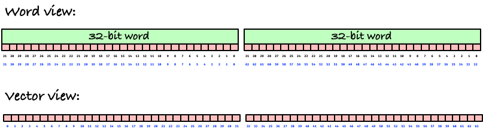

This is an artifact of how we usually write in European culture, but it means that "left" and "right" can get confusing. If, for example, you need to move a bit from a low to a higher index, so move it right in the bit vector, you have to move it left in the word. If you are moving in a single word, it is a simple left shift, `w << k`

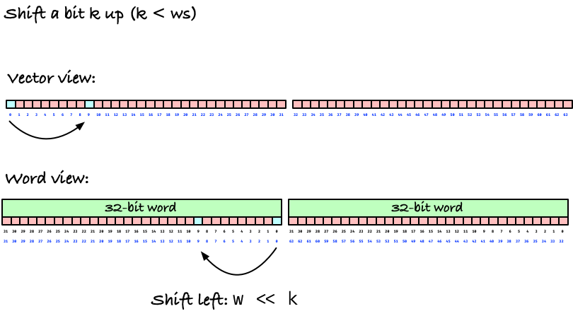

and if you need to shift for more than a word, you have to count the word index up and move the bit to the left.

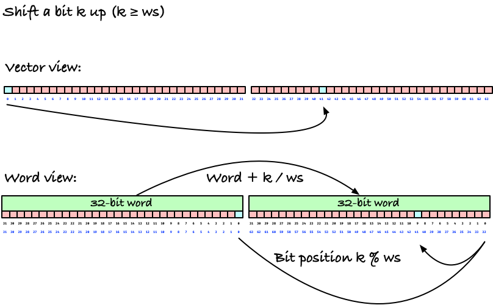

As long as you are not shifting, though, you don't have to worry about that conceptual difference.

## Implementing a bit vector

With all those considerations in place, we can now implement a bit vector spanning multiple words. I have implemented one in C, as a struct that contains the vector's length and then the words immidiately following those.

```c
struct bv
{
    size_t len;
    uint64_t data[];
};
```

The bit that looks like an empty array, `uint64_t data[]`, is a C trick known as a [flexible array member](https://en.wikipedia.org/wiki/Flexible_array_member) and it allows me to allocate the entire vector in a single operation. If you are not programming in C, you can easily ignore that. The magic for using a flexible array member is ugly, anyway, but for completeness it is here:

```c
static inline size_t no_words(size_t no_bits)
{
    // Divide into 64-bit words, rounding up.
    return (no_bits + 63) / 64;
}

struct bv *bv_alloc(size_t no_bits)
{
    size_t header = offsetof(struct bv, data);
    size_t data = sizeof(uint64_t) * no_words(no_bits);
    // Use calloc to satisfy static analysis.
    // It has the added benefit that all new vectors are 0-initialised.
    struct bv *v = calloc(1, header + data);
    assert(v); // We don't handle allocation errors
    v->len = no_bits;
    return v;
}

struct bv *bv_new(size_t len)
{
    return bv_alloc(len);
}

struct bv *bv_new_from_string(const char *str)
{
    size_t len = strlen(str);
    struct bv *v = bv_alloc(len);
    for (size_t i = 0; *str; i++, str++)
    {
        // set to zero if *str == '0' and one otherwise
        bv_set(v, i, *str != '0');
    }
    return v;
}
```

I've written two constructors, `bv_new()` and `bv_new_from_string()` that shares an allocator `bv_alloc()`. The `bv_new_from_string()` lets me construct vectors from a description of its bits, e.g., `bv_new_from_string("10010)`, but it is mostly for testing purposes. The string would take eight times as much space as the bit vector, so for long vectors it is not an efficient approach. I use the `calloc()` function to allocate memory. That will initialise all the memory as zero-bits, so the `bv_new()` function will always return a vector of all zeros.

The getter and setter functions for individual bits look like this:

```c
// Any optimising compiler will work out that / and % can be translated into
// bit shifts and masking when it knows the divisor and the divisor is a power
// of two.
static inline size_t bv_widx(size_t i) { return i / 64; }
static inline size_t bv_bidx(size_t i) { return i % 64; }

static inline bool bv_get(struct bv *v, size_t i)
{
    uint64_t w = v->data[bv_widx(i)];           // Get the word
    return !!((uint64_t)1 & (w >> bv_bidx(i))); // shift the bit down and extract it
}
// Returns itself so we can chain calls. NOTE: this is not an expression
// but a modification, so it has side-effects. Be careful with using this
// in calls where you use the same vector in multiple expressions, since
// the evaluation order is not defined in C.
static inline struct bv *bv_set(struct bv *v, size_t i, bool b)
{
    uint64_t w = v->data[bv_widx(i)]; // Get the word.
    v->data[bv_widx(i)] =
        b                                         // depending on the bit value
            ? (w | (uint64_t)1 << bv_bidx(i))     // mask the bit in
            : (w & ~((uint64_t)1 << bv_bidx(i))); // or mask all the other bits
    return v;
}
```

The comment at the top just says that I use `i / 64` and `i % 64` even though division operations are more expensive than bit operations on the CPU, but the compiler can figure out that I can divide by 64 by shifting the word by 6 (`i / 64 == i >> 6`) and that I can get the remainder with a mask, `i % 64 == i & 63`. So I get fast bit operations without the confusing notation of bit operations. This only works because 64 is a constant that the compiler knows when it compiles, though, and sometimes you want to consider replacing division/remainder with bit operations.

The command about chained calls is something I am not entirely convinced is a good idea. The idea is that I can chain a bit vector construction with setting individual bits

```c
  struct bv *v = bv_new_from_string("10010");
  struct bv *w = bv_set(bv_set(bv_new(5), 1, 1), 4, 1);
  assert(bv_eq(v, w)); // The two vectors are equal
```

A problem is that the function really works with side-effects and if you combine calls of this kind you are modifying the same data, so it is potentially dangerous. I chose convinience over safety, but my choice might have been different any other day.

### Operations

The `bv_eq()` function I just used compares two vectors. It sounds like an easy operator to implement, but there are some interesting issues to consider.

If we say that two vectors are the same if their bits are the same (which is the obvious definition), we might think we can just compare the vectors word-wise.

```c
bool bv_eq(struct bv const *v, struct bv const *w)
{
    if (v->len != w->len) return false;
    for (size_t i = 0; i < no_words(v->len); i++)
        if (v->data[i] != w->data[i]) return false;
    return true;
}
```

That is almost true, but it requires that all the bits are the same, including those bits that sits in the last word beyond the bit-length of the vector.

If we made the two length-five vectors we did above, we only use five out of 64 bits, so there are 59 bits that shouldn't affect whether we consider the two vectors the same. When we allocate vectors, those bits are zero, but if we start shifting bits around, they might not be.

Here we have a choice: either we have to mask out the bits in `bv_eq()` to ignore them, or we need to handle that there might be set bits off the end of the vector.

The latter choice is the better for an important reason. If we shift bits up and then down again, the expected behaviour from how individual words behave is that they get set to zero. They won't if we don't explicitly set them to zero when we have additional bits in the vector. So, I've implemented a function that clears the extra bits, and made the rule that if I modify those extra bits, I have to clean them again afterwards.

```c
// A vector is "dirty" if there are set bits in the last word, beyond the
// last bit. This can happen with shifts, but it complicates some computations
// if we have to mask those out for comparisons or shifts. In those case,
// we should "clean" the vector first.
static void bv_clean(struct bv *v)
{
    size_t k = v->len % 64;
    if (k != 0) // if k == 0 there are no extra bits.
    {
        uint64_t mask = (1 << k) - 1;          // lower k words; we want to keep them.
        v->data[no_words(v->len) - 1] &= mask; // remove the other bits.
    }
}
```

When I started implementing operations, I also noticed that it was mostly boiler-plate code. Running through all the words in the vector and performing some operations, again and again. It isn't much of a problem, but I miss the vectorised operations from R or Numpy, so I decided to write macros to get them.


```c
#define NWORDS(VEC) no_words((VEC)->len)

// The word at the current index
#define WORD(VEC) ((VEC)->data[i_])

// Word offset to the left of the current index.
#define WORD_BEFORE(VEC, OFFSET) \
    (((OFFSET) <= i_) ? ((VEC)->data[i_ - (OFFSET)]) : (uint64_t)0)
// Word offset to the right of the current index.
#define WORD_AFTER(VEC, OFFSET) \
    ((((OFFSET) + i_) < NWORDS(VEC)) ? ((VEC)->data[i_ + (OFFSET)]) : (uint64_t)0)

#define EACH_WORD(VEC, ...)            EACH_WORD_FROM(VEC, 0, __VA_ARGS__)
#define EACH_WORD_FROM(VEC, FROM, ...) EACH_WORD_RANGE(VEC, FROM, NWORDS(VEC), __VA_ARGS__)
#define EACH_WORD_TO(VEC, TO, ...)     EACH_WORD_RANGE(VEC, 0, TO, __VA_ARGS__)
#define EACH_WORD_RANGE(VEC, FROM, TO, ...)   \
    for (size_t i_ = (FROM); i_ < (TO); i_++) \
    {                                         \
        __VA_ARGS__;                          \
    }

#define EACH_WORD_REV_TO(VEC, TO, ...)                      \
    for (size_t ii_ = 0; ii_ < (NWORDS(VEC) - (TO)); ii_++) \
    {                                                       \
        size_t i_ = NWORDS(VEC) - ii_ - 1;                  \
        __VA_ARGS__;                                        \
    }
```

The `NWORDS()` macro tells me how many words I have in a macro. The `WORD()` macro gives me the word at index `i_`, where I use `i_` to refer to indices in the `EACH_WORD...` macros. The `WORD_BEFORE()` and `WORD_AFTER()` macros just adds offsets to those, so `WORD_BEFORE(v, 1)` will give me the word before the current one in vector `v` and `WORD_AFTER(v, 2)` will give me the word two indices after the current one. If I am not indexing at the current index, which I can guarantee refers to a valid word, then I might index out of bounds, and to avoid handling special cases, I just say that I have zero bits beyond the edges of the vector. That will work the expected way with any shifting.

The `EACH_WORD...` macros are just loops through the words in a vector. They vary in where the edges in the iteration is, and the `EACH_WORD_REV_TO()` macro runs through the words in reverse. (I only needed one reverse loop so there is only one variant of that).

With these macros, the `bv_eq()` function looks like this:

```c
bool bv_eq(struct bv const *v, struct bv const *w)
{
    if (v->len != w->len) return false;
    EACH_WORD(v,
      if (WORD(v) != WORD(w)) return false
    );
    return true;
}
```

Not a huge difference, I agree, but the macros help a little in more complicated functions.

Using these macros is another point where I am not sure I made the right choice. They have the benefit of giving me a small language to write vector expressions in, but at the cost of having to understand the macros and how they interact, since those expressions are no longer pure and simple C code. I honestly don't know if it was worth it, but this is what I did, so that is what I show.

We can easily implement a bunch of operations using the macros. The operations generally return their input vector, so I can chain operations, but as I mentioned above, that might not be a great idea. It is just a convinient idea.

```c
// set v to all zeros
struct bv *bv_zero(struct bv *v)
{
    EACH_WORD(v, WORD(v) = (uint64_t)0);
    return v;
}

// set v to all 1
struct bv *bv_one(struct bv *v)
{
    EACH_WORD(v, WORD(v) = ~(uint64_t)0);
    bv_clean(v); // Don't leave 1s in unused bits
    return v;
}

// flip all the bits in v
struct bv *bv_neg(struct bv *v)
{
    EACH_WORD(v, WORD(v) = ~WORD(v));
    bv_clean(v); // Don't leave 1s in unused bits
    return v;
}

// v |= w
struct bv *bv_or_assign(struct bv *v, struct bv const *w)
{
    assert(v->len == w->len);
    EACH_WORD(v, WORD(v) |= WORD(w));
    return v;
}

// v &= w
struct bv *bv_and_assign(struct bv *v, struct bv const *w)
{
    assert(v->len == w->len);
    EACH_WORD(v, WORD(v) &= WORD(w));
    return v;
}

// v | w
struct bv *bv_or(struct bv const *v, struct bv const *w)
{
    assert(v->len == w->len);
    struct bv *u = bv_alloc(v->len);
    EACH_WORD(u, WORD(u) = WORD(v) | WORD(w));
    return u;
}

// v & w
struct bv *bv_and(struct bv const *v, struct bv const *w)
{
    assert(v->len == w->len);
    struct bv *u = bv_alloc(v->len);
    EACH_WORD(u, WORD(u) = WORD(v) & WORD(w));
    return u;
}
```

The functions that can set any of the unused bits must call `bv_clean()`. Of the above, those are `bv_one()` that will set all bits to one, so some must be flipped back, and `bv_neg()` that will leave one-bits where there were previously zero-bits. For the others, if the input vectors are clean, then the output will also be clean.

The shift operations are the hardest, because there we cannot operate on the vector one word at a time. Consider first shifting up, by which I mean moving each bit $b_i$
in the bit vector to position $b_{i+k}$. If we draw this situation with the usual vector view, with indices going left to right, we want to move bits as in the figure below:

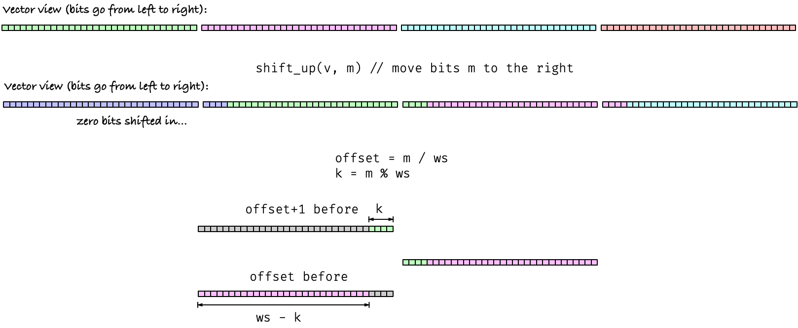

If `offset` is the integral number of words we shift (could be zero if we shift by less than a full word size, or it could be larger), then a word at index `i` will get bits from index `i-offset-1` and `i-offset`. In the drawing, and the code, I use `offset+1` and `offset` because I index an *offset before* the current index, but it amounts to the same thing. If `k` is the additional bits we need to shift after we have shifted the full number of words, then the word `offset+1` before the current word will contribute `k` bits, that will go at the first `k` bits of the current word. The word at `offset` before the current will contribute the remaining `ws - k` bits, and these will go after the `k` bits we got from the `offset+1`-before word.

To move the bits around, we need to take the word-view of the bits, because it is on words we have operations to shift. That just means reversing the order of the bits in each word, because we number the within-word bits from right to left. There we see that it is the lower `k` words in the `offset+1`-before word we need, but shifted so they become the `k` high bits in the current word, and we need the `ws - k` high bits in the `offset`-before word.

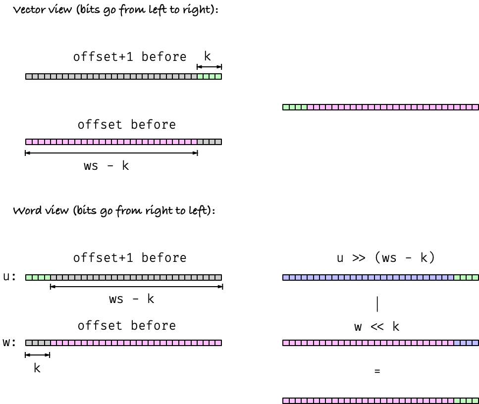

To get the `k` bits we want from the first word down to where they should sit, we shift by `ws - k`, and to get the `ws-k` bits from the second word up where they belong, we shift by `k`. The shifts will leave zeros at the positions we shift in from the edges, so if we OR the two shifted words we get the word we want.

Here we have to be careful once more. The shift `u >> (ws - k)` is undefined if `k == 0`, i.e. we are shiftin an integral number of words, since then `ws - k = ws` and shifting by a full word size might be undefined (as it is in C). It is an annoying special case that I got around by defining a macro that would give me a word of all zero bits if I tried to shift more than the word length. 

```c
// Shifting uint64_t by 64 or more is undefined behaviour in C, but we want such
// shifts to give us zero. It removes special cases here and there, not having to
// check if k is 0 when doing someting like (w >> (64 - k)).
#define RSHIFT(W, K) (((K) < 64) ? ((W) >> (K)) : 0)
#define LSHIFT(W, K) (((K) < 64) ? ((W) << (K)) : 0)

struct bv *bv_shift_up(struct bv *v, size_t m)
{
    size_t k = m % 64;
    size_t offset = m / 64;

    // From offset and up, we shift and or to get the bit patterns,
    // going through the words in reverse.
    EACH_WORD_REV_TO(v, offset, {
        uint64_t u = WORD_BEFORE(v, offset + 1);
        uint64_t w = WORD_BEFORE(v, offset);
        WORD(v) = RSHIFT(u, 64 - k) | LSHIFT(w, k);
    })

    // zero the lower words, simulating that we shifted the bits up.
    EACH_WORD_TO(v, offset, WORD(v) = 0);

    // clean up the bits we might have shifted beyond the end
    bv_clean(v);

    return v;
}
```

When iterating through the words, we should do that in reverse, so we don't accidentally overwrite a word we are going to use later. We always refer to words at the current word-index or earlier, so running through the words right-to-left is safe.

After shifting, the initial words in the array should hold zeros, since that is what we expect to shift in from the edge when we shift, and I explicitly set those. Then I use `bv_clean(v)` to clean up the bits I shifted out into the unused bit, to ensure that they behave like zeros from here on. (They will behave like zeros if the *are* zeros).

You could also split the shifting function into two parts, since shifting an integral number of words is easier and cheaper than dealing with `k > 0`, and then you don't have to deal with the case when `ws-k == ws`, so you could get a faster version.

```c
struct bv *bv_shift_up(struct bv *v, size_t m)
{
    size_t k = m % 64;
    size_t offset = m / 64;

    if (k == 0)
    {
        EACH_WORD_REV_TO(v, offset, WORD(v) = WORD_BEFORE(v, offset));
    }
    else
    {
        // From offset and up, we shift and or to get the bit patterns,
        // going through the words in reverse.
        EACH_WORD_REV_TO(v, offset, {
            uint64_t u = WORD_BEFORE(v, offset + 1);
            uint64_t w = WORD_BEFORE(v, offset);
            WORD(v) = (u >> (64 - k)) | (w << k);
        })
    }

    // zero the lower words, simulating that we shifted the bits up.
    EACH_WORD_TO(v, offset, WORD(v) = 0);

    // clean up the bits we might have shifted beyond the end
    bv_clean(v);

    return v;
}
```

I'm not sure which version I prefer myself.

Shifting down is very similar. There, you will look at words to the right, so you should iterate left-to-right, and the shifting is in the other direction, but otherwise there should be nothing surprising in it.

```c
struct bv *bv_shift_down(struct bv *v, size_t m)
{
    size_t k = m % 64;
    size_t offset = m / 64;

    // From zero up to (n - offset) we shift and or to get the bit patterns.
    EACH_WORD_TO(v, NWORDS(v) - offset, {
        uint64_t u = WORD_AFTER(v, offset);
        uint64_t w = WORD_AFTER(v, offset + 1);
        WORD(v) = RSHIFT(u, k) | LSHIFT(w, 64 - k);
    })

    // zero the upper words, simulating that we shifted the bits down.
    EACH_WORD_REV_TO(v, NWORDS(v) - offset, WORD(v) = 0);

    // clean up the bits we might have shifted beyond the end
    bv_clean(v);

    return v;
}
```

## Application: The SHIFT-and-OR (Dömölki-(Baeza-Yates)-Gonnet) pattern matching algorithm

Let's wrap the topic with an application of bit vectors. There are countless to choose from, but I've picked an algorithm for so-called exact pattern matching, which is a fancy term for finding out where a pattern, `p`, (a string) occurrs in another string.

A simple approach to finding occurrences is something like this: run though each position `i` in `x` and imagine placing `p` there, so `p[0]` aligns with `x[i]`. Then match forward from zero to the length of `p`, `m`, as long as the characters matches, `p[j] == x[i + j]`. If there is a mismatch, break from the inner loop and move `i` forward. If you get to `j == m - 1` in the inner loop (that you only enter if the characters match), then all `m` characters of `p` matches at position `i`, and you can report an occurrence.

```c
void match(const char *x, const char *p)
{
    size_t n = strlen(x);
    size_t m = strlen(p);
    for (size_t i; i < n; i++)
    {
        for (size_t j = 0; j < m && (x[i + j] == p[j]); j++)
        {
            if (j == m - 1)
            {
                printf("We have a match at %lu.\n", i);
            }
        }
    }
}
```

This approach runs in $O(nm)$, but there is very little overhead in it, so it is usually efficient enough. However, for genome scale strings, we want something faster.
You can get $O(n + m)$ or even better (if you add some preprocessing and search for multiple patterns, like in a read-mapping application). There is an entire class on that, so I won't go on and on about it. Instead, I will show you another
$O(nm)$ algorithm that we can speed up with bit vectors.
The *SHIFT-and-OR* algorithm uses time $O(nm/\mathrm{ws})$, which if word sizes are constant (which they are) is still
$O(nm)$, but if the word size is 64 you are potentially dividing the running time by 64. (It isn't quite that good, because there is additioanl overhead in the SHIFT-and-OR algorithm, but it usually is a rather fast algorithm in many applications).

The idea will be to match several prefixes of our pattern against a character in `x`, in parellel. Word-size of them, so we can use parallel bit-operations to do it.

But first, imagine that we had a table `match[i,j]` that encoded whether the prefix of `p` that ends at index `j` matches the length-`j+1` substring of `x` that ends at index `i`. The way the bit operations will be encoded, we won't use 1 to indicate that these two string match, but that they mismatch. Of course, that just means that `match[i,j]` is zero when the two strings match, so it is the same information, it is just that the operations can be done a little easier.

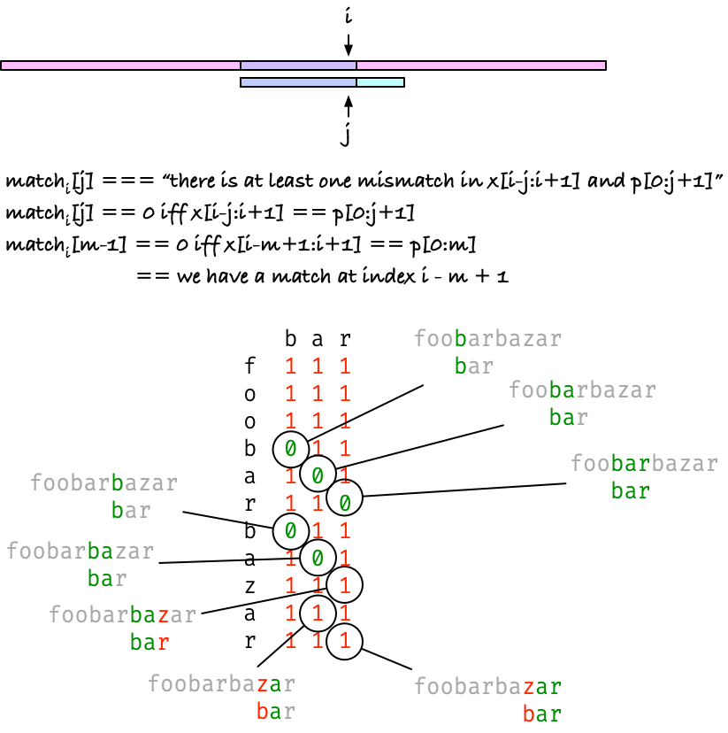

In the figure, I have used a subscript for `i`, rather than an index into the table. This is because we will end up not using multiple rows, and the index `i` will be implicit in the algorithm. We will actually only have a single bit vector `match` that we can index from zero to `m - 1`.

Notice that from the definition, if `match[m - 1] == 0` we know that there are no mismatches between the two sub-strings, and when we are looking at `m - 1`, we are looking at the entire string `p`. (Usually, we use indices `foo[i:j]` to indicate the range from `i` included to `j` excluded, and I do that in the notation in the figure as well, but the `match` table tells us if we have a mismatch in the strings up-to-and-included. The last index in `p` is `m - 1` so if there are no mismatches up to there, i.e. `match[m - 1] == 0`, then we have a match).

We could compute each value in `match[i,j]` by comparing strings, it would take $O(n^3)$, but the idea is of course to compute it faster. Consider what you need to know to compute `match[i,j]`, i.e., whether there are any mismatches between the two strings that end in `(i,j)`. There we observe that there will be a mismatch if either there is one in the previous strings, `(i-1,j-1)`, or if `p[j] != x[i]`, and we can use an OR to combine these two.

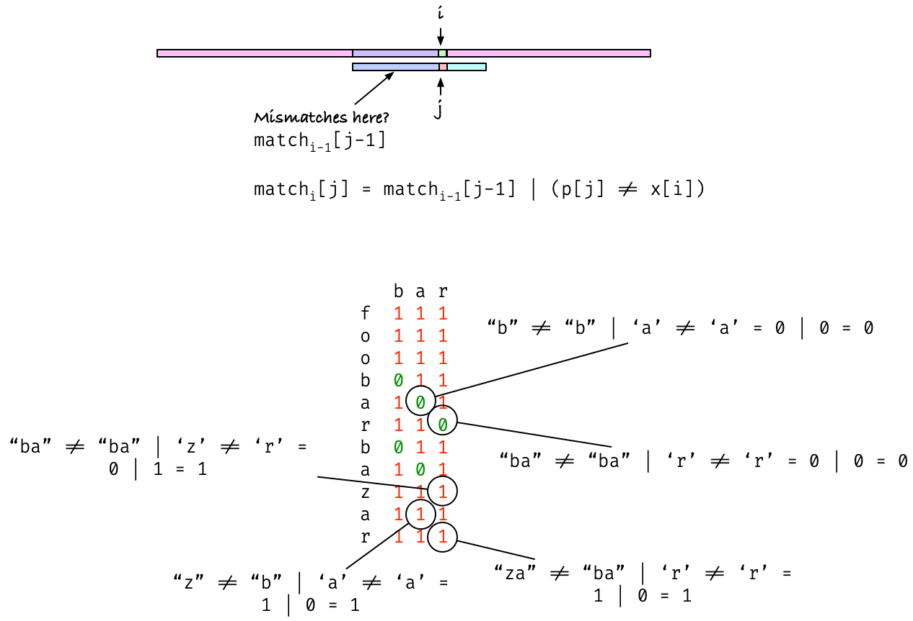

But then we can also observe that looking at `match[i-1,j-1]` to compute `match[i,j]` resembles a shift of `match[i-1,:]`. If we shift the bits in `match[i-1,:]` one up, we move each `match[i-1,j-1]` to position `j`, and there we can OR it with a vector, pmask[i,j]` that for each index `j` has `p[j] != x[i]`.

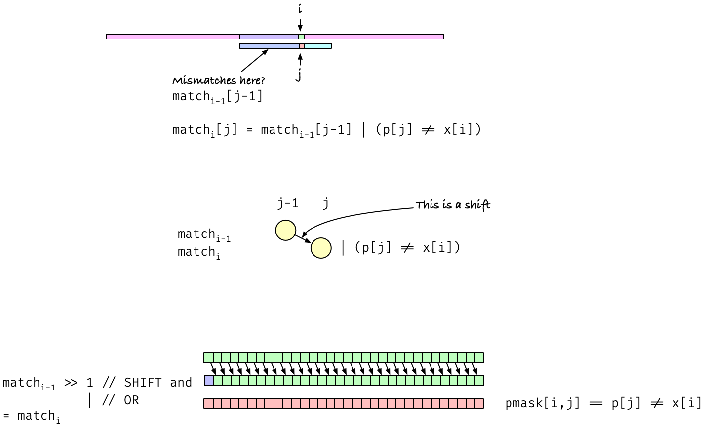

We just need such a `pmask`. It doesn't depend on the actual `i`, just the letter `x[i]`, so we can precompute such vectors for each letter in our alphabet. Just start by setting each bit to zero, and then set to zero the indices `j` where you have a match.

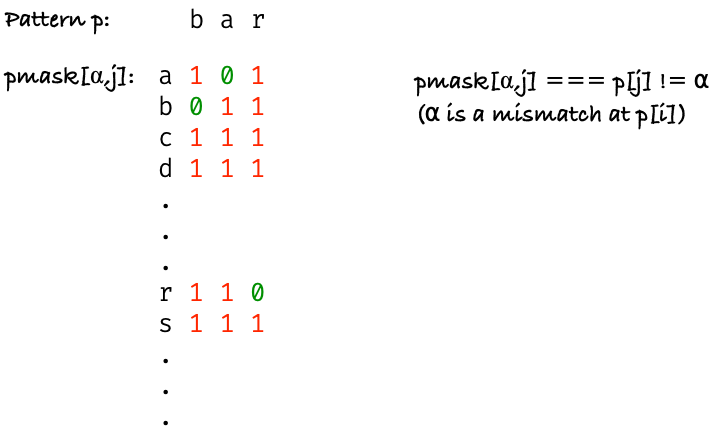

This will take time $O(m\mathrm{ws} + m)$, see the code below for details.

```c
#define sigma 256 // size of alphabet (assumed one byte letters)

static struct bv **build_pattern_masks(size_t m, const char p[m])
{
    struct bv **pmask = malloc(sigma * sizeof *pmask);
    assert(pmask);

    // Build table of all ones
    for (size_t a = 0; a < sigma; a++)
    {
        pmask[a] = bv_set(
            bv_one(bv_new(m)),
            m, 0);
    }

    // Set matches to zero
    for (size_t i = 0; i < m; i++)
    {
        // Set pmatch[a]'s i'th bit to 0 if there is an a
        // at index i in the pattern.
        bv_set(pmask[(unsigned)p[i]], i, 0);
    }

    return pmask;
}

static void free_pattern_masks(struct bv **pmask)
{
    for (size_t a = 0; a < sigma; a++)
    {
        free(pmask[a]);
    }
    free(pmask);
}
```

From here on, it is just following the algorithm. Run through each index in `x`, shift the current match vector and OR it with the relevant mask, and then check if you have a match.

```c
int main(int argc, const char *argv[])
{
    if (argc != 3)
    {
        fprintf(stderr, "Usage: %s string pattern\n", argv[0]);
        return 1;
    }

    const char *x = argv[1];
    const char *p = argv[2];
    size_t n = strlen(x);
    size_t m = strlen(p);

    struct bv **pmask = build_pattern_masks(m, p);
    struct bv *match = bv_one(bv_new(m));

    for (size_t i = 0; i < n; i++)
    {
        // match = (match << 1) | mask[x[i]]
        bv_or_assign(
            bv_shift_up(match, 1),
            pmask[(unsigned)x[i]]);

        if (bv_get(match, m - 1) == 0)
        {
            printf("match at: %lu\n", i - m + 1);
        }
    }

    free(match);
    free_pattern_masks(pmask);

    return 0;
}
```

Using the generic bit vectors is a bit of overkill for typical applications where you would use this algorithm. It is fast if the patterns are small and we can pack the bit vectors into single words, but if you need to process larger patterns you are better off with other algorithms.

If you are going to use this algorithm, you would probably just use bit vectors you could fit in single words, and then the code is slightly simpler:

```c
#define word uint64_t
#define WORD_SIZE 64
#define sigma 256 // size of alphabet (assumed one byte letters)

int main(int argc, const char *argv[])
{
    if (argc != 3)
    {
        fprintf(stderr, "Usage: %s string pattern\n", argv[0]);
        return 1;
    }

    const char *x = argv[1];
    const char *p = argv[2];
    size_t n = strlen(x);
    size_t m = strlen(p);

    if (m >= WORD_SIZE)
    {
        fprintf(stderr, "Pattern too long.\n");
        return 1;
    }

    word *pmask = malloc(sigma * sizeof *pmask);
    assert(pmask); // abort on allocation failure (unlikely as it is).

    // Set all bits to 1. memset() does it for bytes, but if we set all the
    // bytes to 0xff then we also set all the bits to one.
    memset(pmask, 0xff, sigma * sizeof *pmask);

    // Set matches to zero
    word match = (word)1; // Moves 1 up through the length of p
    for (size_t i = 0; i < m; i++, match <<= 1)
    {
        // Set pmatch[a]'s i'th bit to 0 if there is an a
        // at index i in the pattern.
        pmask[(unsigned)p[i]] &= ~match; // set the match-bit to zero
    }

    match = ~(word)0;                    // state vector through the scan
    word check_bit = (word)1 << (m - 1); // (m-1)'th bit for checking matches
    for (size_t i = 0; i < n; i++)
    {
        match = (match << 1) | pmask[(unsigned)x[i]];
        if ((match & check_bit) == 0)
        {
            printf("match at: %lu\n", i - m + 1);
        }
    }

    free(pmask);

    return 0;
}
```

I hope this has given you an idea of how to implement and manipulate bit vectors, whether you want generic implementations or just application-tailored ones. Their usage goes far beyond simple string algorithms like the one we have seen, so it is worth familiarising yourself with them.


[^1]: But not more than $2^{64} \approx 1.8\times 10^{19}$ with 64-bit pointers, and actually less on modern 64-bit systems, but this limit is far higher than the limit set by your physical memory available.


